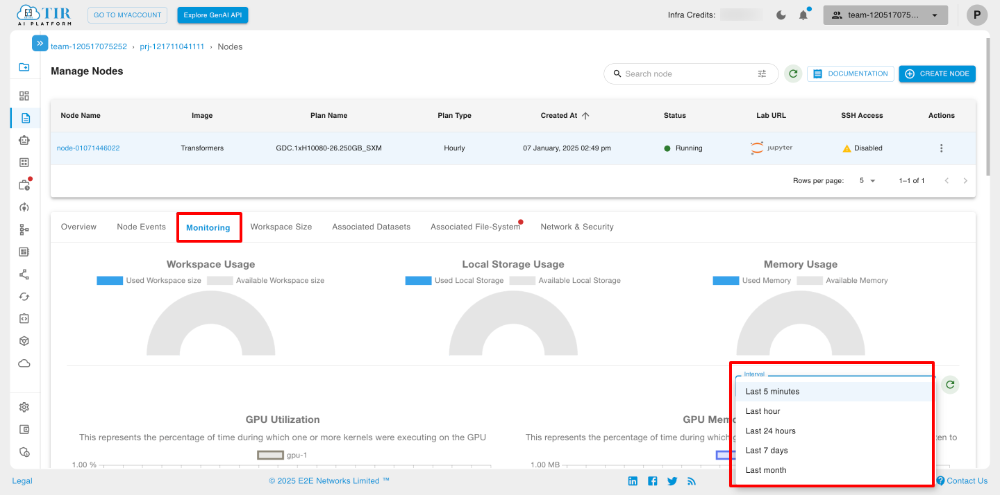
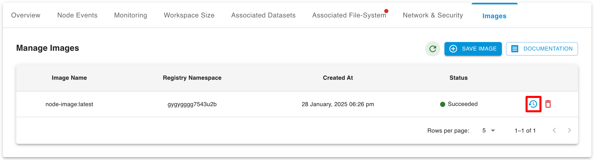
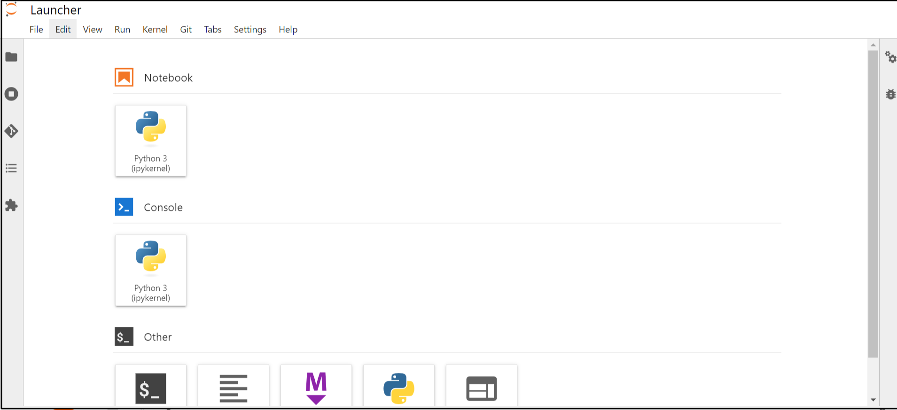
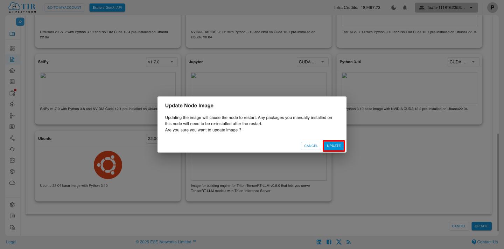
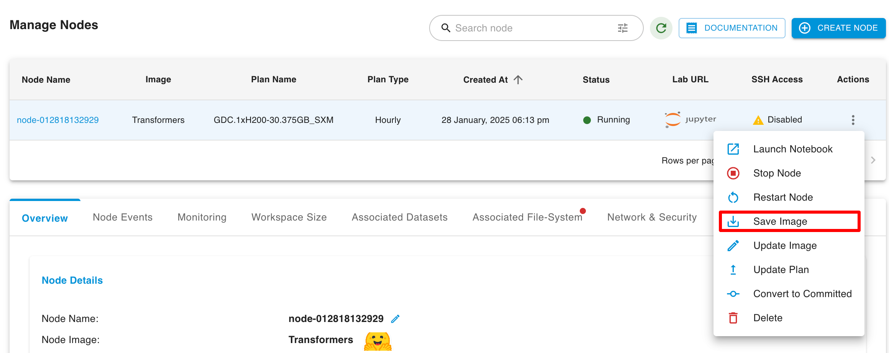
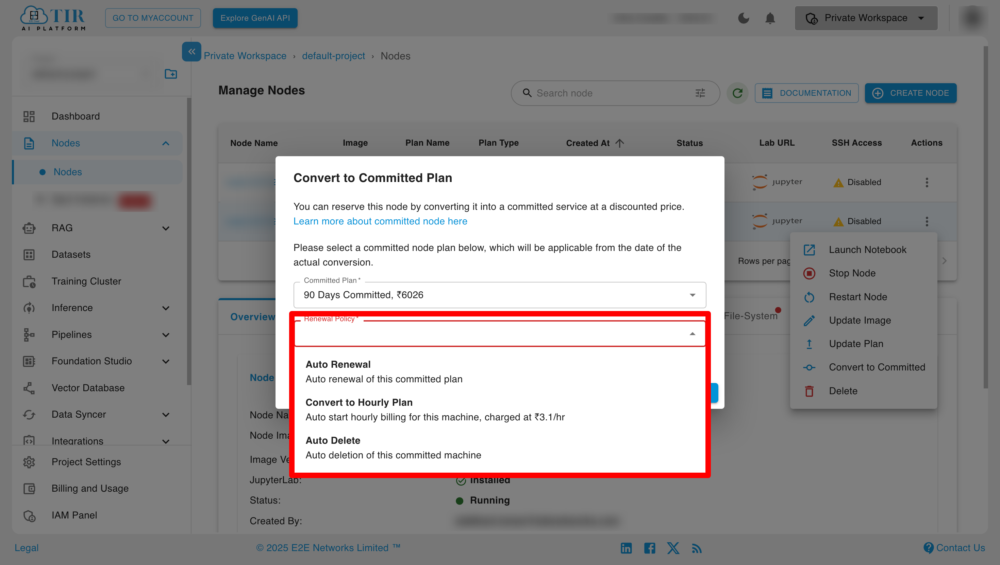
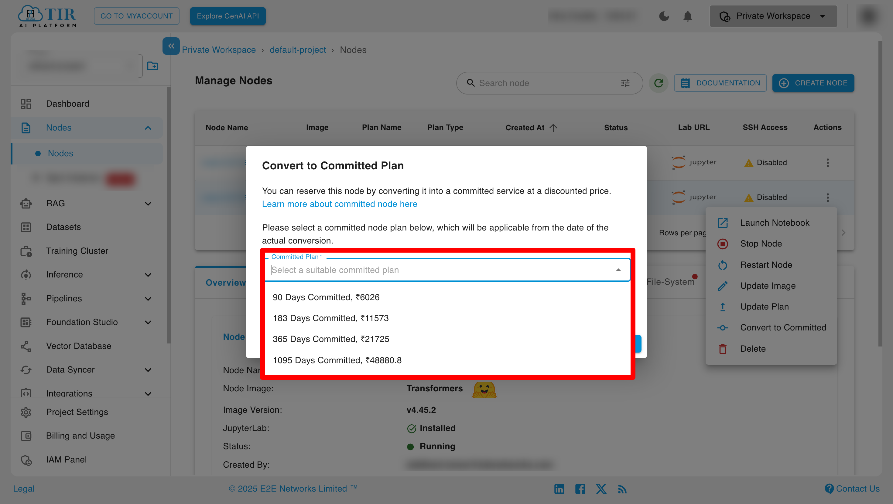
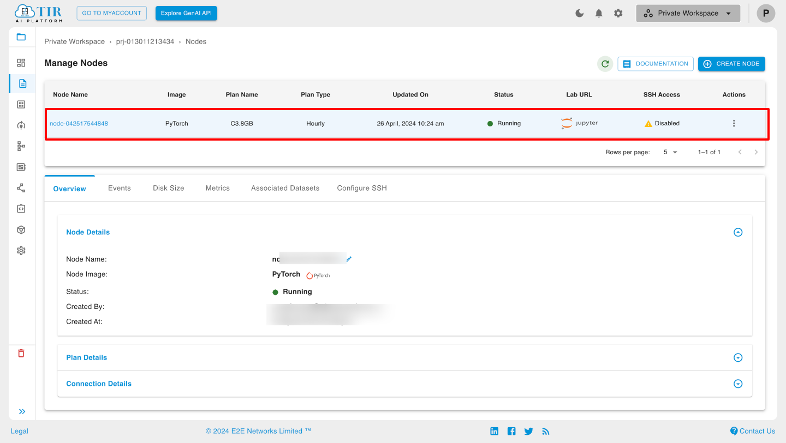
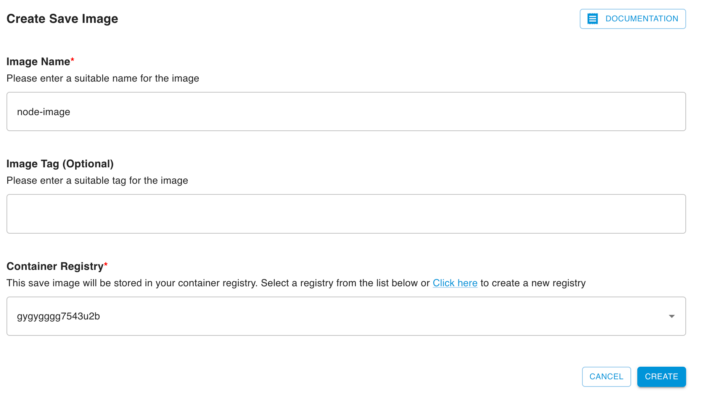
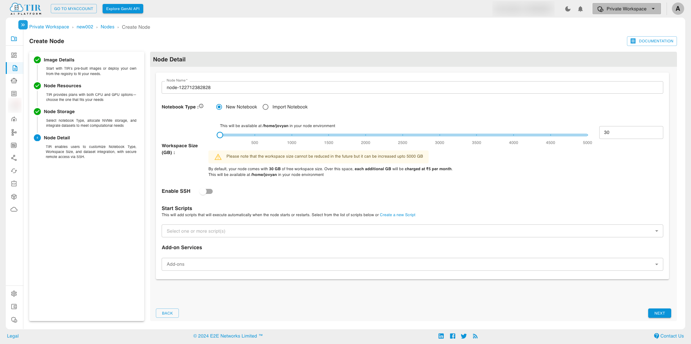

# E2E Networks TIR Nodes - Complete Guide

**Source:** [E2E Networks TIR Documentation](https://docs.e2enetworks.com/docs/tir/Nodes/GuideTIR/)  
**Generated:** July 30, 2025  
**Reading Time:** ~15 minutes  

---

## 📋 Table of Contents

1. [Overview](#overview)
2. [Getting Started](#getting-started)
3. [Node Images](#node-images)
4. [Node Configuration](#node-configuration)
5. [Creating a Node](#creating-a-node)
6. [Node Management](#node-management)
7. [Node Actions](#node-actions)
8. [Advanced Features](#advanced-features)

---

## Overview

**TIR Nodes** are fully collaborative environments that make AI development possible. They combine the power of containers, Jupyter Labs, and AI/ML frameworks to create a readily usable workspace for you and your entire team.

### 🎯 Common Use Cases

- **Fine-tune Large Language Models (LLMs)** on single GPU using PyTorch or Hugging Face
- **Multi-GPU training** for LLMs or Diffusion models using DeepSpeed and Accelerate
- **Run Jupyter notebooks** from GitHub, Kaggle, or Colab
- **Download and review datasets** from TIR or Hugging Face
- **Test AI models** like Stable Diffusion or any LLM

### 💡 Key Features

> **Note:** A TIR node is a fully functional coding environment. You can configure SSH access to work with command line tools, upload data via SFTP, or sync code with Git.

---

## Getting Started

### Step 1: Login and Project Setup

1. **Login** using your myaccount credentials
2. **Select TIR AI platform** to access resources
3. **Create a project** using the "Create project" button
4. **Access Nodes** from the side panel

*Click "Create Node" to start the process*

### Step 2: Node Selection

1. **Choose CPU or GPU plan** (Free Tier available for testing)
2. **Select appropriate plan** based on requirements
3. **Name your node** and choose type:
   - **New Notebook:** Empty JupyterLab environment
   - **Import Notebook:** Pull from GitHub or Colab

### Step 3: Configuration

1. **Select workspace size** (30 GB free by default)
2. **Enable SSH Access** (optional)
3. **Choose access method** when ready (Jupyter Labs or SSH)

---

## Node Images

TIR supports various pre-built container images optimized for different workflows:

### 🖥️ Available Image Types

#### **Base OS Image**
- Clean container environment with no pre-installed packages
- Maximum flexibility for custom setups
- Lightweight and ideal for tailored environments

*Base OS node selection interface*

#### **Jupyter Image**
- Pre-installed Jupyter Notebook environment
- Perfect for interactive development
- Supports `.ipynb` files directly in browser

#### **ComfyUI Image**
- Visual and generative AI workflows
- Drag-and-drop interface for model pipelines
- Ideal for image generation and creative tools

#### **FramePack Image**
- Pre-configured FramePack framework
- Optimized for specialized use cases
- Ready-to-use environment for FramePack projects

*Choose from TIR Pre-built, Base OS, or Container Registry images*

---

## Node Configuration

### 🔧 Configuration Options

#### **SSH Access**
- Enable using public key or password
- Must stop node before enabling SSH
- Provides command-line access to environment

#### **Storage Options**

**Standard Disk:**
- Up to 5,000 GB available
- Default: 30 GB free
- Mounted at `/home/jovyan`
- Persistent across restarts

**Local NVME Storage (H100 only):**
- High-speed local storage at `/mnt/local`
- Available only during runtime
- Perfect for model checkpoints

*Select CPU or GPU resources based on your needs*

#### **Pricing Plans**
- **Hourly:** Pay-as-you-go flexibility
- **Committed:** Discounted rates with longer commitment

### 📊 Node Status Types

| Status | Description |
|--------|-------------|
| **Waiting** | Node being deployed on selected hardware |
| **Running** | Active node, accessible via Jupyter/SSH |
| **Stopped** | Node paused, workspace preserved |
| **Pending** | Waiting for resources (48-72 hours) |
| **Expired** | Resource request no longer in queue |

---

## Creating a Node

### Step-by-Step Process

#### 1. **Image Selection**

*Container Registry selection with JupyterLab specification*

#### 2. **Resource Planning**

*Filter CPU and GPU resources for tailored selection*

#### 3. **Storage Configuration**

*Configure storage and add datasets to your node*

#### 4. **Node Details**

*Provide essential details before node creation*

#### 5. **Summary Review**

*Review all configuration details before creation*

#### 6. **Node Management**

*Access your nodes from the management dashboard*

---

## Node Management

### 📊 Overview Dashboard

*Complete node details and plan information*

### 📈 Monitoring

**Real-time Metrics:**
- CPU Utilization graphs
- Memory usage tracking
- Custom time intervals

*Monitor CPU and memory utilization over time*

**Activity Tracking:**

*View one-month activity breakdown by days and hours*

### 💾 Storage Management

*View and modify disk size as needed*

**Update Process:**

*Change disk size and click update to apply*

### 📁 Dataset Management

*Manage mounted and unmounted datasets*

### 🔐 Network & Security

**SSH Configuration:**

*Configure SSH keys for secure access*

**IP Management:**

*Attach or detach reserved IP addresses*

**Port Configuration:**

*Add custom ports for your applications*

---

## Node Actions

### 🚀 Core Operations

#### **Launch Notebook**

*Node launching interface*

*Successfully launched node with access options*

#### **Node Control**
- **Stop Node:** Pause execution, preserve workspace
- **Restart Node:** Reboot with same configuration
- **Update Image:** Change to different container image
- **Update Plan:** Modify CPU/GPU configuration

> **Important:** Node must be stopped before updating configuration

#### **Convert to Committed**

*Convert hourly nodes to committed plans for discounts*

### 💾 Image Management

#### **Save Custom Images**

*Save your configured environment as custom image*

**Process:**
1. Click "Save Image" button
2. Enter descriptive name
3. Select container registry
4. Image appears in registry for reuse

*Restore saved images with all dependencies*

---

## Advanced Features

### 🔍 Node Search & Filtering

*Search nodes by name*

*Access advanced filtering options*

*Configure advanced search parameters*

### 📜 Start Scripts

**Script Management:**

*Attach scripts for automated node setup*

**Script Creation:**

*Create new scripts for node automation*

**Script Editor:**

*Upload files or write scripts directly*

**Script Library:**

*Manage, update, or delete existing scripts*

> **Note:** Script changes take effect only after node restart. Scripts cannot be deleted if attached to active nodes.

### 🔄 Quick Actions

**Sidebar Launch:**

*Launch nodes directly from sidebar*

---

## 🎯 Best Practices

### **Resource Selection**
- Use **Free Tier** for exploration and testing
- Choose **A100 or H100** for production workloads
- Consider **committed plans** for cost savings

### **Storage Strategy**
- Use `/home/jovyan` for persistent data
- Leverage `/mnt/local` (H100) for temporary high-speed storage
- Regular backups to EOS buckets recommended

### **Image Management**
- Start with pre-built images
- Save custom configurations as images
- Use `requirements.txt` for package management

### **Security**
- Prefer SSH keys over passwords
- Configure appropriate network access
- Regular security updates

---

## 📞 Support

For additional assistance:
- **Storage > 5TB:** Raise support ticket
- **Technical Issues:** Contact E2E Networks support
- **Documentation:** Visit [E2E Networks Docs](https://docs.e2enetworks.com/)

---

*This professional documentation was generated from the original E2E Networks TIR guide, enhanced with improved structure, visual elements, and comprehensive coverage of all features.*
