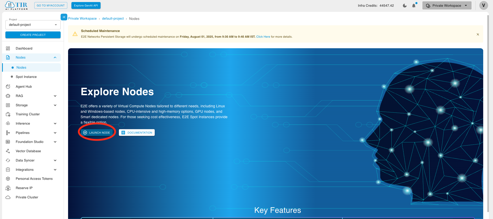
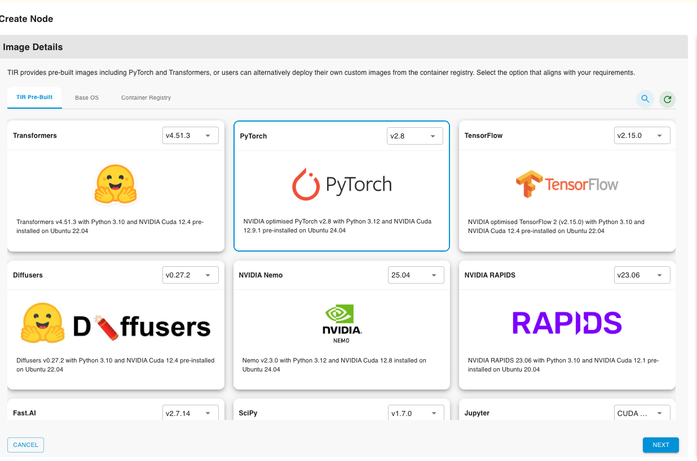
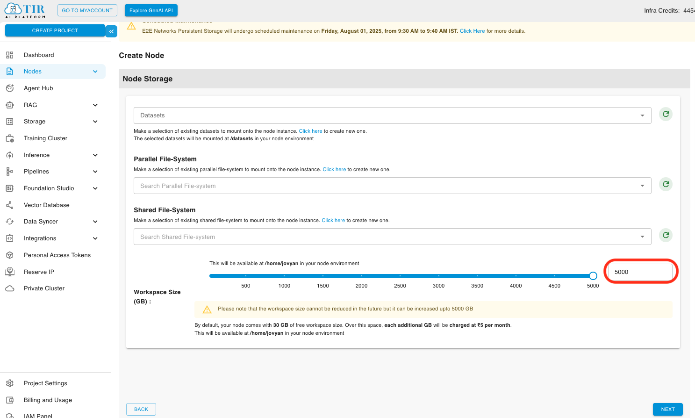
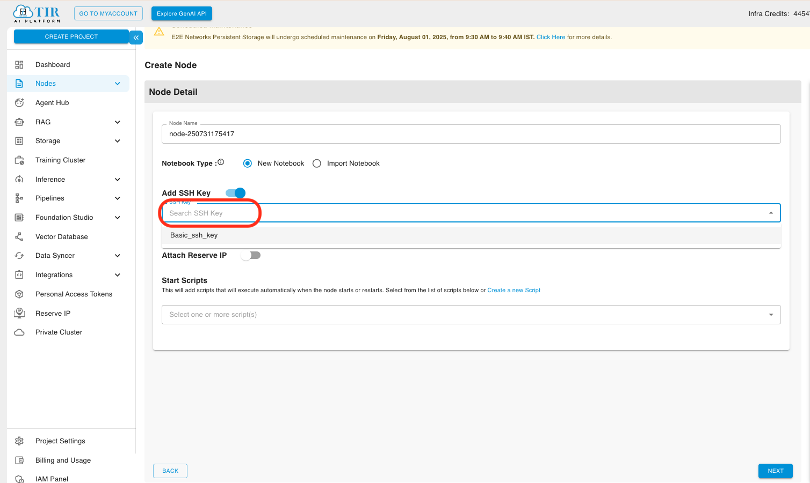
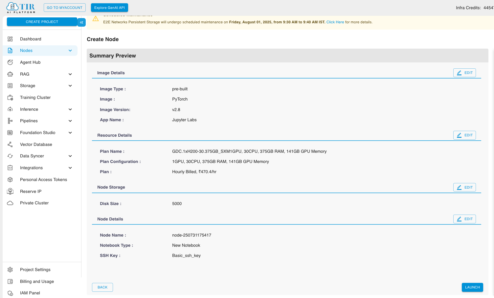

> 🧠 **TL;DR / Quick Summary**
>
> This guide walks you through how to use **TIR Nodes** on the E2E Networks platform — GPU-powered compute instances ideal for AI, ML, and data workloads.
>
> 🔧 You’ll learn how to:
> - Launch nodes with specific GPU/CPU/Disk configurations
> - Attach and manage persistent storage
> - Access nodes securely via SSH (with SSH key-based login)
> - Perform lifecycle operations: restart, stop, release, etc.
> - Monitor your node’s status, usage, and billing
> - Troubleshoot common issues (e.g., disk not showing, SSH failures)
>
> 👤 Ideal for:
> - ML engineers deploying model training workloads
> - DevOps teams managing GPU compute infrastructure
> - Researchers or developers who need cloud GPU access
>
> ⚠️ This guide is based on the latest TIR platform experience. Make sure to refer to platform updates for version-specific features.

**TIR Nodes: Containerized Environments for AI and Machine Learning**

**What are TIR Nodes?**

TIR Nodes are specialized, self-contained computing environments that provide a flexible and secure space for developing, testing, and deploying artificial intelligence (AI) and machine learning (ML) applications.

**Key Features of TIR Nodes**

TIR Nodes offer a range of features that make them ideal for various use cases:

* **Interactive Development**: Use JupyterLab, a popular web-based interface, to interactively develop and test your AI and ML applications.
* **Compute Optimization**: Take advantage of optimized GPU and CPU resources to accelerate your machine learning workloads.
* **Customizable Environments**: Choose from prebuilt environments, including PyTorch, Hugging Face, and ComfyUI, or create your own custom environment to suit your needs.
* **Secure Access**: Access your TIR Node securely using SSH (Secure Shell) protocol.
* **Persistent Storage**: Store your data and models with persistent storage, featuring disk management for efficient data handling.

**Why Use TIR Nodes?**

TIR Nodes are perfect for:

| Use Case | Description |
| --- | --- |
| **Training Machine Learning Models** | Train and fine-tune your machine learning models in a secure and optimized environment. |
| **Rapid Prototyping** | Quickly develop and test your AI and ML applications in an interactive and flexible environment. |
| **Data Processing** | Process large datasets efficiently using optimized compute resources. |
| **Deploying AI-based Solutions** | Deploy your AI and ML models in a secure and scalable environment. |

**Glossary**

* **Node**: A self-contained computing environment that provides a specific set of resources and tools.
* **Image**: A pre-configured environment that includes a set of software packages and dependencies.
* **Plan**: A predefined configuration for a TIR Node, including the type of compute resources and storage allocated.

## Creating a New Node

### Before You Begin

Make sure you have the following before creating a node:

- An active [MyAccount](https://myaccount.e2enetworks.com) login
- A project created under **TIR**
- An SSH key added to your profile (if you want SSH access)

> 💡 **Tip**: You can add your SSH key anytime from **MyAccount → Profile → SSH Keys**.

---

### Steps to Create a TIR Node

#### 1. Log in to MyAccount
- Visit [myaccount.e2enetworks.com](https://myaccount.e2enetworks.com) and sign in.

#### 2. Select a Project
- Navigate to **Projects → TIR**.
- Choose your desired project.

#### 3. Open the Nodes Tab
- Click the **Nodes** tab in the top navigation.
- Then click **+ LAUNCH NODE**.

#### 4. Choose an Image
Select from the following options:
- **Prebuilt**: Environments like PyTorch, ComfyUI, etc.
- **Base OS**: Ubuntu or other bare OS options.(Link to access the guide)
- **Container Registry**: Use a custom container image.(Link to access the guide)

#### 5. Select a Compute Plan
- **CPU**: For general development
- **GPU**: For ML training, inference, or compute-heavy tasks  
> 💡 **Tip**: Some GPU plans may require approval — you’ll be notified if that’s the case.

#### 6. Set Disk Size
- Default is **30 GB**. You can go up to **5 TB**.
- NVMe-backed disks provide high-speed performance.

#### 7. Configure the Notebook
Choose one of:
- **New Notebook**: Start from scratch
- **Import Notebook**: Restore from previous sessions((Link to access the guide))

#### 8. Enable SSH (Optional)
- Toggle SSH access if needed.
- Ensure your public key is added in MyAccount.tir

#### 9. Summary Preview
- You can edit any section of the summary preview.
- Click **LAUNCH**. Your node will be provisioned.

---

### After Creation

Once the node is ready, its status will be **Running**. You can access it via:
- **JupyterLab**: From the dashboard's **Access** button
- **SSH**: If you enabled SSH during setup

---

## Configuring a Node

While creating a TIR node, you can customize several key options based on your needs. Here's a breakdown of each configuration step:

### 📦 Image Selection

Choose the environment your node will run:

| Image Type | Description |
|------------|-------------|
| **Prebuilt Images** | Pre-configured containers optimized for ML/AI tasks (e.g., PyTorch, ComfyUI). |
| **Base OS** | A clean OS environment for full customization. |
| **E2E Container Registry** | Use a custom image you've uploaded to the E2E registry. |

---

### ⚙️ Compute Plan

Pick the processing resources your workload requires:

| Plan Type | Description |
|-----------|-------------|
| **CPU** | Good for development, data prep, and light workloads. |
| **GPU** | Required for training models, inferencing, or intensive AI compute. |

> 💡 **Tip**: Some GPU plans require approval. You’ll be notified during creation if your plan needs it.

---

### 📓 Notebook Type

Decide how your Jupyter environment should be initialized:

| Option | Description |
|--------|-------------|
| **New Notebook** | Start with a clean, new workspace. |
| **Import Notebook** | Resume from a previously saved session. |

---

### 💾 Disk Size

Your storage defines how much data you can persist on the node:

| Disk Size | Use Case |
|-----------|----------|
| **30 GB (default)** | Suitable for lightweight tasks and testing. |
| **Up to 5 TB** | For large datasets, training checkpoints, or extended use.

> 💡 **Tip**: Disks are persistent and mounted at **`/home/jovyan`** inside the container.

---

### 🔐 SSH Access (Optional)

Enable SSH if you prefer terminal-based interaction:

- ✅ **Enable SSH** toggle during node creation
- 🔑 **SSH Key** must be added in **MyAccount → Profile → SSH Keys**

> 💡 **Tip**: Always add your public SSH key *before* enabling SSH, or connection will fail.

## Accessing and Managing Your Node

Once your node is created, you can access and manage it through the following methods and states.

---

### 🔗 Accessing Your Node

You can access the node in two ways:

- **JupyterLab**  
  Launch directly from the dashboard by clicking the **Access** button. This opens a web-based interactive notebook.

- **SSH (Optional)**  
  If enabled during creation, connect via terminal using your SSH key.  
  > 💡 **Tip**: Make sure your SSH key is added in **MyAccount → Profile → SSH Keys** before attempting access.

---

### 📊 Node Statuses

Your node may transition through the following statuses:

| Status | Description |
|--------|-------------|
| **Running** | Node is active. You can access it via JupyterLab or SSH. |
| **Pending** | Node is waiting for resources to be allocated. This may take time depending on demand. |
| **Stopped** | Node is turned off, but your data is retained. Restart anytime. |
| **Deleting** | Node is being permanently removed and will no longer be available. |

---

### 💾 Persistent Disk & Billing Behavior

> 💡 **Tip**: All data is stored in a persistent disk mounted at **`/home/jovyan`**, which means your files remain safe even if the node is stopped or restarted.

> 💸 **Cost Behavior**:
- While **Running**: You are charged for both compute and storage.
- While **Stopped**: You are charged **only for storage**.
  
> ✅ **Recommendation**: Stop your node when not in use to reduce compute costs.

## ❓ Frequently Asked Questions

### 🧠 Node Management and Data Persistence

#### Q: Will my data be lost if I stop the node?

  
<strong>A:</strong> No, your data is safe. Disks are persistent and mounted at <code>/home/jovyan</code>.

#### Q: Can I change the disk size later?

  
<strong>A:</strong> Yes. Stop the node, resize the disk, and restart.

#### Q: Why is my node stuck in "Pending"?

  
<strong>A:</strong> Resources might not be available. Try switching to a different plan or wait until capacity frees up.

#### Q: Can I switch from a CPU to a GPU node?

  
<strong>A:</strong> No. You need to create a new node and select a GPU plan during creation.

---

### 💡 Best Practices

- 🛑 **Stop nodes** when not in use to avoid unnecessary compute charges.
- 🎯 **Use Free Tier** for smaller, lightweight workloads to stay cost-effective.
- 🔑 **Add SSH keys in advance** via MyAccount → Profile → SSH Keys to avoid delays.

> 💬 **Didn’t find your question?**  
> Visit the [E2E Support Portal](https://docs.e2enetworks.com) or raise a ticket via the dashboard.

